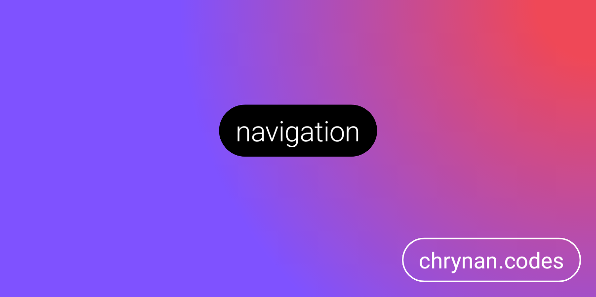

# navigation

Kotlin multi-platform application navigation library. Supports Jetpack Compose. <br/><br/>


```kotlin
val navigator = rememberNavigator("Greeting")

NavContainer(navigator) { _, destination ->
    when (destination) {
        "Greeting" -> Text("Hello")
        "Farewell" -> Text("Good-bye")
        else -> Text("Unexpected Key: $key")
    }
}

navigator.goTo("Farewell")
```

## Getting Started 🏁

The library is provided through [Repsy.io](https://repsy.io/). Checkout
the [releases page](https://github.com/chRyNaN/navigation/releases) to get the latest version. <br/>


### Repository

```groovy
repositories {
    maven {
        url = uri("https://repo.repsy.io/mvn/chrynan/public")
    }
}
```

### Dependencies

#### core

```groovy
implementation("com.chrynan.navigation:navigation-core:VERSION")
```

#### compose

```groovy
implementation("com.chrynan.navigation:navigation-compose:VERSION")
```

### Usage 👨‍💻

* Create a `Navigator` for any `NavigationDestination` type that you will use as a destination key. This can be Strings,
  enums, sealed classes, or any type.

```kotlin
enum class Destination {

    HOME,
    SETTINGS,
    DETAILS
}

@Composable
fun App() {
    val navigator = rememberNavigator(initialDestination = Destination.HOME)
}
```

* Create a `NavContainer` to display the current content based off of the latest navigation context and destination
  values.

```kotlin
@Composable
fun App() {
    val navigator = rememberNavigator(initialDestination = Destination.HOME)

    NavContainer(navigator = navigator) { _, destination ->
        when (destination) {
            Destination.HOME -> HomeScreenComposable()
            Destination.SETTINGS -> SettingsScreenComposable()
            Destination.DETAILS -> DetailsScreenComposable()
        }
    }
}
```

* Use the `Navigator` instance to navigate between navigation contexts and destinations.

```kotlin
BackHandler { navigator.goBack() }
```

#### Navigation Contexts

Complex navigation flows require multiple stacks of navigation destinations that may be retained when changing stacks.
These stacks are referred to as `NavigationContext` in this library. A `NavigationContext` is an interface that defines
the default navigation destination. For example:

```kotlin
enum class MainNavigationContext(
    val title: String,
    val icon: ImageVector,
    override val initialDestination: Destination
) : NavigationContext<Destination> {

    HOME(title = "Home", icon = Icons.Default.Home, initialDestination = Destination.HOME),

    SETTINGS(title = "Settings", icon = Icons.Default.Settings, initialDestination = Destination.SETTINGS)
}
```

Then to change the current context, use the `Navigator.changeContext` function:

```kotlin
navigator.changeContext(MainNavigationContext.SETTINGS)
```

#### Transitions and animations

You have complete control over the composables that render the UI of the application and can use the Jetpack Compose
library's transition and animation APIs to change between the navigation context and destination UIs. For more
fine-grained control, create a custom composable replacing the `NavContainer` that handles transitions properly for your
application. Then just listen and react to the `Navigator.state` changes.

```kotlin
@Composable
fun <Destination : NavigationDestination, Context : NavigationContext<Destination>> MyNavContainer(
    navigator: Navigator<Destination, Context>,
) {
    val context = navigator.state.currentContextAsState()
    val destination = navigator.state.currentDestinationAsState()

    // Render UI from context and destination values and apply any transition or animtation desired.
}
```

## Documentation 📃

More detailed documentation is available in the [docs](docs/) folder. The entry point to the documentation can be
found [here](docs/index.md).

## Security 🛡️

For security vulnerabilities, concerns, or issues, please responsibly disclose the information either by opening a
public GitHub Issue or reaching out to the project owner.

## Contributing ✍️

Outside contributions are welcome for this project. Please follow the [code of conduct](CODE_OF_CONDUCT.md)
and [coding conventions](CODING_CONVENTIONS.md) when contributing. If contributing code, please add thorough documents.
and tests. Thank you!

## Sponsorship ❤️

Support this project by [becoming a sponsor](https://www.buymeacoffee.com/chrynan) of my work! And make sure to give the
repository a ⭐

## License ⚖️

```
Copyright 2021 chRyNaN

Licensed under the Apache License, Version 2.0 (the "License");
you may not use this file except in compliance with the License.
You may obtain a copy of the License at

   http://www.apache.org/licenses/LICENSE-2.0

Unless required by applicable law or agreed to in writing, software
distributed under the License is distributed on an "AS IS" BASIS,
WITHOUT WARRANTIES OR CONDITIONS OF ANY KIND, either express or implied.
See the License for the specific language governing permissions and
limitations under the License.
```
